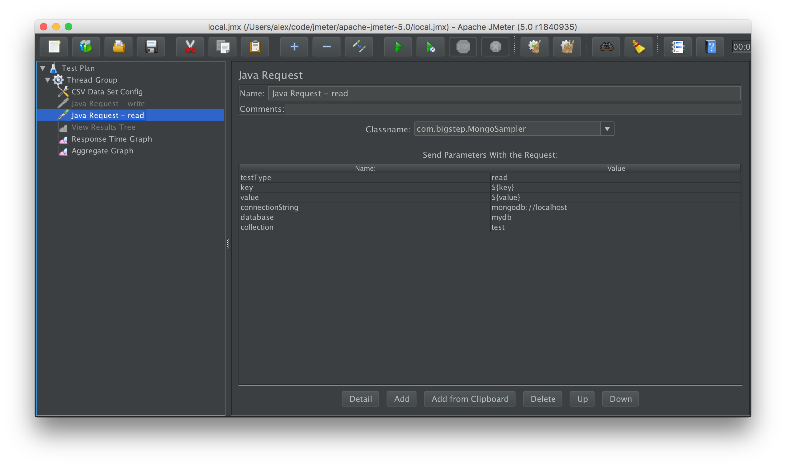

# jmeter-mongo-db-custom-sampler
Reactive streams based jmeter mongo db custom sampler

### Compile
To compile run. 
```
mvn package
```
Note: This will also run several unit tests which use an embeded mongo server to test the sampling functions. I admit this might be a bit of an overkill but old habits die hard.
Since it will atempt to download the mongo database for the embedded test and it might take some time, to skip it use:
```
mvn package -Dmaven.test.skip=true
```

### Installation
This was tested with jmeter 5.0. To use copy the resulting jar (from the target directory) to 
jmeter's lib/ext directories. 

Also copy (should work with other versions as well):
* mongo-java-driver-3.9.1.jar
* mongodb-driver-async-3.9.1.jar
* mongodb-driver-reactivestreams-1.10.0.jar
* reactive-streams-1.0.2.jar

### Usage
 
The class will show up at the Java Sampler dropdown menu.
All of the params need to be filled in including the key and value.
Use Jmeter's value generator to randomize these values or read 
them from a file.




### Test Types
The testType configuration setting is used to specify the type of test to perform:
* "write"  the "key" field will be used to populate the "_id" field of the inserted documents and the value field to populate a "value" field.
* "read"  the "key" field will be used to retrieve the documents with the specified "_id". The value field is optional and if provided it will be used to test the retrieved value against the provided one. The test will fail if they do not match. This could to test for data corruption.    
* "writeMany" the "key" field will be used to populate the "_id" field of the inserted documents like this: $key-$i where $will be between 0 and batchSize. The value field to populate a "value" field.
* "readMany"  the "key" field will be used to retrieve the documents with the specified "_id" like this: $key-$i where $will be between 0 and batchSize. The value field is optional and if provided it will be used to test the retrieved value against the provided one. The test will fail if they do not match. This could to test for data corruption.
### Using a CSV dataset

The typical scenario is to use a CSV dataset to load keys into a variable and use that to measure writes and the same var to measure reads on the previously inserted keys.
To generate a 1m key-value pairs with pairs of 100 chars and a random UUID key. For very big numbers this might take a while.
``` 
python sbin/genkeysandvals.py 1000000 100 > input.csv
```
